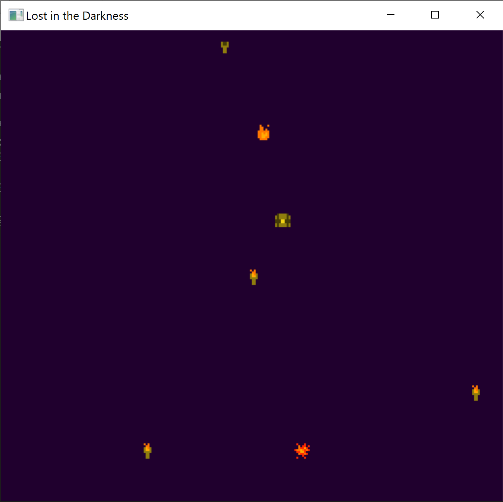

# Lost in the Darkness

Author: Anna Li

Design: You, the flame, must traverse a dark room and light all the torches in order for the door to the next room to open. If you're lucky, you'll find a chest holding the key, and the door will open immediately; if you're unlucky, you'll find a chest holding a bomb!

Screen Shot:

How Your Asset Pipeline Works:

I drew my assets as PNGs using pixelartmaker.com -- this includes sprite images, as well as room layouts. A room layout is described using x pixels, where each pixel is some object in the room. The RGB value of each pixel is broken down into object information, like the type of object (torch, key, bomb) and its (x, y) position. Then, CreateTiles.cpp reads in these files as binary data and writes it to tiles.bin, which is read into PlayMode to create the sprites and rooms.

How To Play:

Use the arrow keys to move. The room is pitch black, so you'll need to get closer to an object in order to illuminate it. Once you've lit all the torches or found the key, a door will open -- head to the door to go to the next room.

Sources: All assets created by Anna Li.

This game was built with [NEST](NEST.md).

